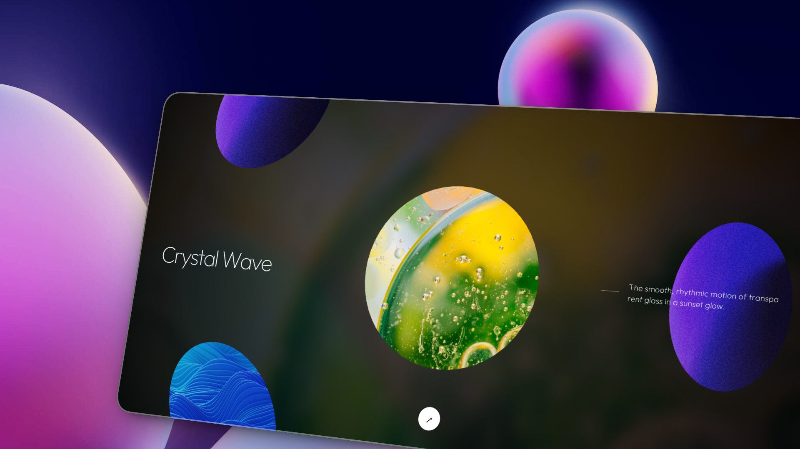

# ✦ Infinite Menu

A **premium, WebGL-powered interactive menu** built with Next.js, featuring deep-space exploration aesthetics, cinematic animations, and multi-layer parallax effects.



---

## ✨ Features

- **WebGL 3D Sphere Grid** — Items are rendered as interactive 3D spheres using raw WebGL and gl-matrix, with full Arcball rotation control via mouse drag.
- **Multi-Layer Parallax** — Background, canvas, and UI text move at independent speeds relative to the cursor, creating a true sense of depth.
- **Hybrid Background System** — Displays a random blurred background image on load. When you stop on an item, it smoothly transitions to that item's image.
- **Cinematic Typography Animations** — Titles and descriptions animate letter by letter with a blur + translate entrance effect using Framer Motion staggerChildren.
- **Animated Separator Line** — The decorative line next to the description expands and contracts in sync with the text.
- **Abstract Iridescent Theme** — 8 high-quality abstract liquid and iridescent images (chrome, neon, crystal, pearl, gold, spectrum, prism, iris).
- **Premium Typography** — Uses the **Outfit** variable font loaded natively via `next/font/google` for zero layout shift and all weight support (100–900).
- **Vignette Overlay** — Cinematic radial gradient to focus attention on the center content.

---

## 🛠 Tech Stack

| Technology | Purpose |
|---|---|
| **Next.js 16** (App Router) | Framework & routing |
| **React 19** | UI rendering |
| **WebGL + gl-matrix** | 3D sphere grid rendering |
| **Framer Motion** | Animations & parallax |
| **Tailwind CSS v4** | Styling |
| **Outfit (Google Fonts)** | Typography |

---

## 🚀 Getting Started

### Prerequisites
- Node.js 18+
- npm

### Installation

```bash
# Clone the repository
git clone https://github.com/sebastianvasquezechavarria1234/infinite-menu.git
cd infinite-menu

# Install dependencies
npm install

# Start the development server
npm run dev
```

Open [http://localhost:3000](http://localhost:3000) in your browser.

### Build for Production

```bash
npm run build
npm run start
```

---

## 📁 Project Structure

```
├── public/
│   └── abstract/          # 8 abstract iridescent images
│       ├── chrome.jpg
│       ├── neon.jpg
│       ├── wave.jpg
│       ├── pearl.jpg
│       ├── gold.jpg
│       ├── spectrum.jpg
│       ├── prism.jpg
│       └── iris.jpg
├── src/
│   ├── app/
│   │   ├── layout.js      # Root layout with Outfit font
│   │   ├── page.js        # Menu items configuration
│   │   └── globals.css    # Global styles
│   └── components/
│       └── InfiniteMenu.js # Core WebGL + UI component
```

---

## 🎨 Customization

### Changing Menu Items

Edit `src/app/page.js` to update the items array:

```js
const items = [
  {
    image: '/abstract/chrome.jpg',  // Path to image in /public
    link: '#',                       // Navigation link
    title: 'Chrome Flow',            // Display title
    description: 'Your description here.'
  },
  // ... more items
];
```

### Adjusting Parallax Sensitivity

In `src/components/InfiniteMenu.js`, search for the parallax multipliers:

```js
// Background layer (most movement)
animate={{ x: -mousePos.x * 0.6, y: -mousePos.y * 0.6 }}

// Canvas layer (medium movement)
animate={{ x: -mousePos.x * 0.4, y: -mousePos.y * 0.4 }}

// UI text layer (subtle movement)
animate={{ x: -mousePos.x * 0.6, y: -mousePos.y * 0.6 }}
```

Increase the multiplier for more movement, decrease for subtlety.

---

## 📄 License

MIT License — feel free to use, modify and distribute.

---

<p align="center">Built with ✦ by Sebastian Vasquez</p>
